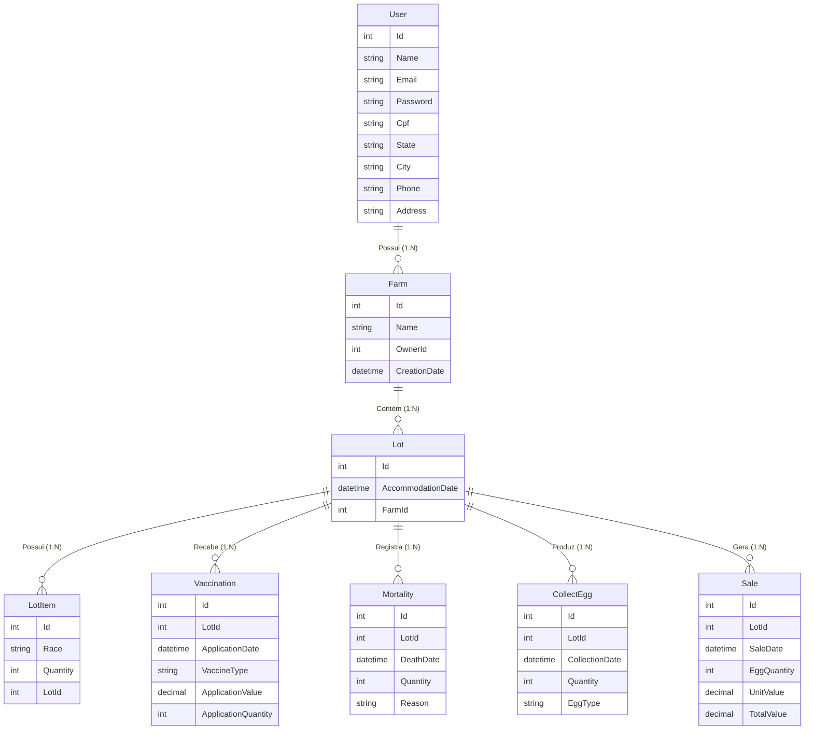

# Modelagem do Banco de Dados

Abaixo está a representação da modelagem de dados atual do sistema **FarmSystem**, mostrando as tabelas e seus relacionamentos.

## Diagrama Entidade-Relacionamento (ERD)

## Descrição das Relações

1.  **User -> Farm**: Um usuário pode ter múltiplas granjas (embora a regra de negócio atual limite a uma por simplicidade inicial).
2.  **Farm -> Lot**: Uma granja pode ter vários lotes de aves ao longo do tempo.
3.  **Lot -> LotItem**: Um lote pode ser composto por múltiplas linhagens (raças) diferentes, cada uma com sua quantidade inicial.
4.  **Lot -> Monitoramentos (Vaccination, Mortality, CollectEgg, Sale)**: Todos os eventos diários e financeiros estão atrelados a um **Lote** específico, permitindo o rastreamento detalhado da produtividade e saúde daquele grupo de aves.
